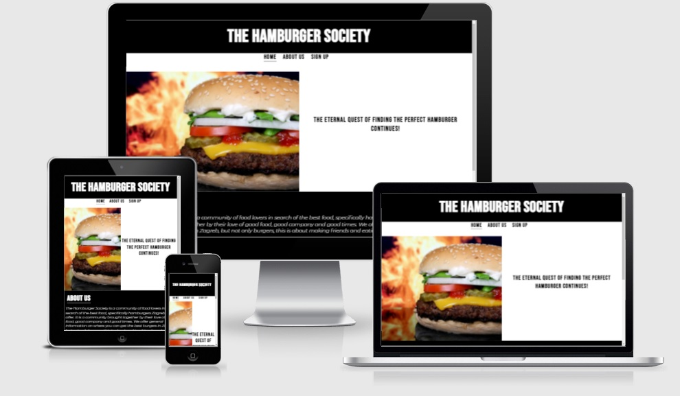

# The Hamburger Society

The Hamburger Society is a food themed website focused on creating a vibrant community of food enjoyers, specifically focused on finding the best hamburgers in the greater Zagreb area.

Users of the site will be able to connect with other members via our social media and if they sign up, they will also receive a concise monthly "foodletter" detailing excellent spots to find food in Zagreb.

## Features

 <h2>Navigation</h2>
<ul><li>On the top of the page right under the main page title, fully responsive navigation bar
<li>The navigation bar consists of links to the Home page,internal link to the about section and a link to the sign up page
<li>The navigation bar elements are simply marked in black contrasting the white background for ease of use
</ul>

## Header
<ul>
<li>The header displays an image of a delicious hamburger with a fiery background
<li>To the right of the image is a short and almost medieval aspiration of the society
</ul>

## About Us
<ul>
<li>The About Us section has a short description of the idea around the community and their beliefs
<li>A benefits list is included as an easy way to describe what this community offers to its users
<li>It is styled in the same way the previous sections of the page, a very simple contrasting black and white style which offers a classy and simple look reflecting of a hamburger as a food itself
</ul>

## Footer

<ul><li>A basic footer reflecting the rest of the page with hyperlinked social media icon
<li>Icons styled in a black color contrasting the white background
</ul>

## Sign Up Page

<li>Header and Footer remain the same as the home page with the exclusion of the About Us internal link
<li>The body of the page consists of a simple form requesting First and Last Name and email with a submit button</li>

## Features Left To Implement
<ul><li>A simple forum-like feature
<li>Foodletter
</ul>

## Testing

<ul><li>I confirmed that the site works on multiple different browsers: Chrome, Mozilla Firefox, Microsoft Edge
<li>The site is responsive and works on different standard screen sizes using the dev tools
<li>All the links/internal links work as intended
<li>The selected color contrast ensures that the content/text/navigation is easily readable
<li>I have confirmed the form on the Sign Up page works and requires all fields filled with relevant data
</ul>

## Bugs

<ul><li>I had trouble resizing the main header image to fit all screen sizes
<li>The page title was overlapping the content on smaller screen sizes
<li>The problems were fixed using  @media queries in style.css
</ul>

## Unfixed Bugs

<li>No unfixed bugs

## Validator Testing

<ul>HTML
<li>No errors were found when the code was passed through the official W3C validator
</ul>
<ul>CSS
<li>No errors were found when the code was passed through the official W3C (Jigsaw) validator
</ul>
<ul>Accessibility
<li>The colors and fonts chosen are cotrasting and easy to read which is confirmed by running the site through the Lighthouse in dev tools
</ul>

## Deployment

The site was deployed to GitHub pages in these steps:
<li>In the GitHub repository, navigate to the Settings tab
<li>From the source section drop-down menu, select the Master Branch
<li>Once the master branch has been selected, the page produced the link to the complete page</li>

The live link is provided here: *LINK*

## Credits

### Content
 
  The code in the footer for the social media was taken from CI [Love Running] (https://github.com/Code-Institute-Org/love-running-2.0)

### Media

The images used in the header and sign up page are from https://pxhere.com/

